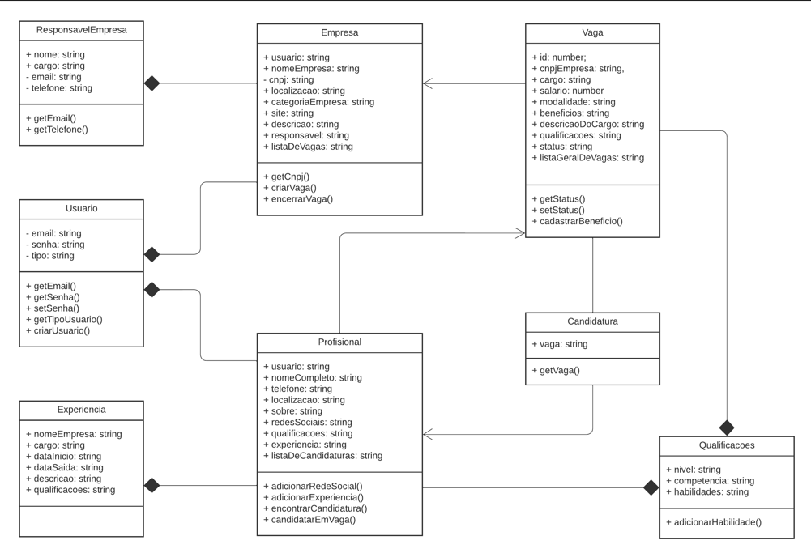

# Elas

Elas é um projeto desenvolvido em JavaScript que consiste em uma plataforma de empregos voltada para o público feminino na área de tecnologia. O projeto visa fornecer uma interface intuitiva para que empresas possam cadastrar vagas e profissionais possam buscar oportunidades de emprego.

O Projeto foi desenvolvido como conclusão do curso de Imersão em JavaScript, oferecido pela Instituição **{Reprograma}**, turma ON28 - 10/2023.


## Estrutura do Pojeto

O Projeto é composto po diferentes classes que interagem entre si para proporcionar a funcionalidade completa da plataforma. O Projeto inclue as classe:

#### 1. Usuario
A classe Usuario representa um usuário na plataforma. Possui métodos para gerenciar informações iniciais ao se cadastrar na plataforma, como e-mail, senha e tipo de cadastro (Profissional ou Empresa)

#### 2. Empresa
A classe Empresa representa uma empresa na plataforma, ela possui métodos para gerenciar informações básicas de uma empresa cadastrada, como nome da empresa, CNPJ, vagas de emprego publicadas, entre outros.

#### 3. Profissional
A classe Profissional representa uma profissional na plataforma, ela possui métodos para gerenciar informações básicas de uma profissional cadastrada, como nome, telefone, localização, experiências profissionais, qualificações, candidaturas realizadas, entre outros.

#### 4. ResponsavelEmpresa
A classe ResposávelEmpresa representa uma pessoa responsável por uma empresa cadastrada. Ela contém informações como nome, cargo, email e telefone do responsável.

#### 5. Qualificações
A classe Qualificações gerencia as qualificações necessárias para uma vaga ou experiência profissional. Ela armazena o nível de qualificação e a área de atuação, além de permitir adicionar habilidades específicas.

#### 6. Experiencia
Representa a experiência profissional de um usuário. Contém informações como nome da empresa, cargo, datas de início e saída, descrição e qualificações relacionadas.

#### 7. Vaga
A classe Vaga é responsável por representar uma vaga de emprego. Ela contém informações como cargo, salário, modalidade, descrição do cargo e qualificações necessárias.

## Diagrama UML


## Rodando localmente

Clone o projeto

```bash
  git clone https://github.com/RoxanieFernandes/elas
```

Entre no diretório do projeto

```bash
  cd elas
```

Instale as dependências

```bash
  npm install
```

## Testes
O projeto possui cobertura de testes completa utilizando o framework Jest. Cada classe e funcionalidade foram testadas para garantir o correto funcionamento do sistema.


**Rodando os testes**

Para rodar os testes, rode o seguinte comando

```bash
  npm test
```

## Melhorias Futuras

* Criação de uma interface para o usuário final.
* Melhorias relacionadas a: filtro de busca e maior proteção de dados.
* Criação de uma banco de dados para armazenamento dos registros cadastrados na plataforma.

## Considerações Finais

Durante a concepção e impementação deste projeto, enfrentei diversos desafios que me permitiram crescer e evoluir significativamente. Um dos pricipais obstáculos foi a criação do método *candidatarEmVaga*, onde tive dificuldade de desenvolver a lógica à ser aplicada, no entanto através de pesquisas em materiais de aulas anteriores, pude superá-lo.

Participar da {reprograma} foi uma experiência enriquecedora, pois não apenas pude aplicar os conhecimentos adquiridos durante o curso, mas também desenvolvi habilidades de comunicação, que são cruciais para o meu desenvolvimento profissional. Este projeto me possibilitou enxergar de maneira mais clara a importância da colaboração, da persistência e da criatividade no processo de desenvolvimento de soluções.

Por fim, expresso minha profunda gratidão à equipe da {reprograma}, as professoras que me orientaram e as colegas que ofereceram suporte ao longo dessa jornada. Suas contribuições foram inestimáveis para o sucesso deste projeto.

Este projeto não apenas representa um marco em minha jornada pessoal, mas também me motiva a continuar buscando novos desafios e oportunidades de crescimento.

## Autores

- [@RoxanieFernandes](https://www.github.com/RoxanieFernandes)

